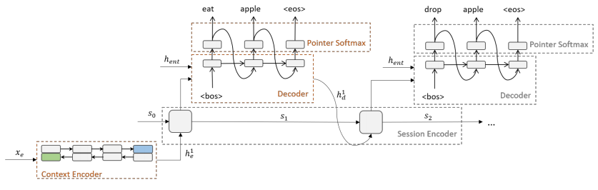

# Readings

----

## Towards Solving Text-based Games by Producing Adaptive Action Spaces

https://arxiv.org/pdf/1812.00855.pdf

Adaptive action spaces are seen as a supervised learning task: `(input, label) -> admissible_commands`. Admissible means it can change the game's state. 

Approaches:

1. a pointer-softmax model that uses beam search to generate multiple commands (worst performer);
2. a hierarchical recurrent model with pointer-softmax generating multiple commands at once;
3. a pointer-softmax model generating multiple commands at once.

*Note*: Beam search uses breadth-first search to build its search tree. At each level of the tree, it generates all successors of the states at the current level, sorting them in increasing order of heuristic cost.

*Related*: Seq2Seq. LSTM-DQN. GloVe. Bidirectional RNN.

They use the full inventory and look description for training. These need to be replaced in a more realistic challenge by the learned features from the environment.

*Bottomline*: How important is it to be able to generate unseen commands?

----

## Playing Text-Adventure Games with Graph-Based Deep Reinforcement Learning

https://arxiv.org/pdf/1812.01628.pdf